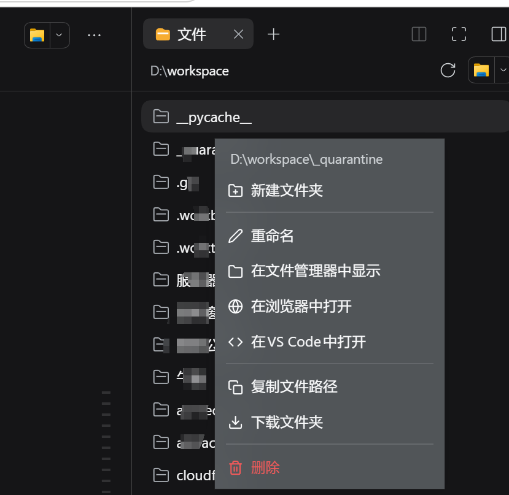
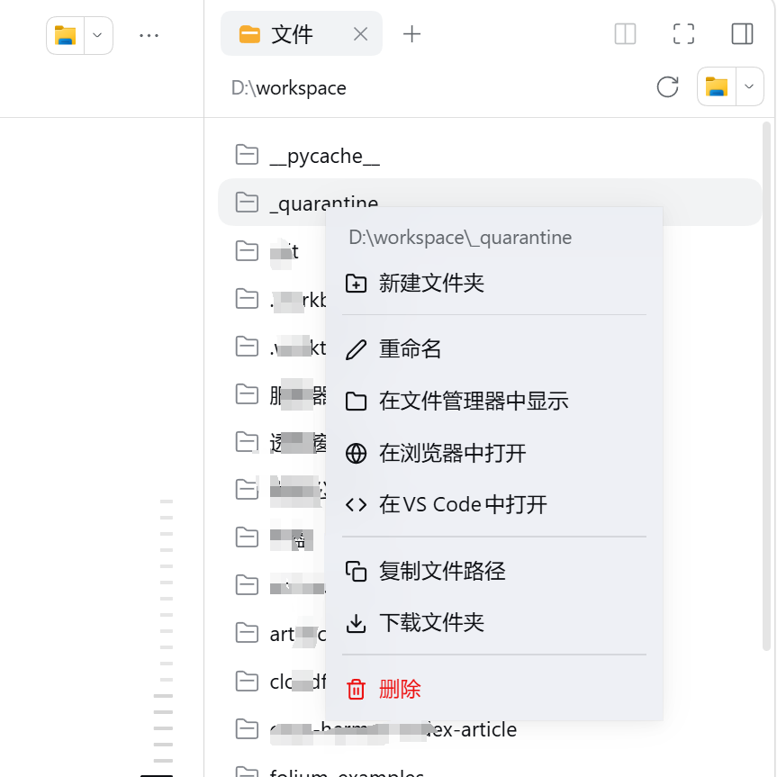

# dsh-menu — DeepSeek Harness 插件（当前：工作区文件右键菜单）

[](https://www.npmjs.com/package/dsh-menu)
[](https://www.npmjs.com/package/dsh-menu)
[](./LICENSE)
[](https://github.com/topics/dsh-plugin)

> 为 DeepSeek Harness **Web 客户端**侧边栏的「工作区文件」树添加自定义右键菜单，替代浏览器默认菜单。
> 纯前端 + Host 路由实现，**无第三方依赖、无构建步骤**。项目名为 `dsh-menu`，后续可在此基础上扩展更多菜单。

| 深色模式 | 浅色模式 |
|:---:|:---:|
|  |  |

<sub>右键「工作区文件」中的任意行 → 自定义菜单（新建文件夹 / 重命名 / 在文件管理器中显示 / 在浏览器中打开 / 在 VS Code 中打开 / 复制文件路径 / 下载文件夹 / 删除）</sub>

---

## ✨ 功能特性

右键「工作区文件」任意文件 / 文件夹行，弹出自定义菜单（顺序即菜单顺序）：

| # | 菜单项 | 说明 |
|---|--------|------|
| 1 | **新建文件夹** | 内联输入框；目录行在其内部创建，文件行在其父目录创建 |
| 2 | **重命名** | 内联输入框，可编辑当前文件名 |
| 3 | **在文件管理器中显示** | 调用官方 remote 服务，在资源管理器中定位该文件 |
| 4 | **在浏览器中打开** | 文件原样返回内容；目录渲染为可浏览的 HTML 列表 |
| 5 | **在 VS Code 中打开** | 自动解析本机 VS Code 并打开文件/目录 |
| 6 | **复制文件路径** | 复制工作区路径到剪贴板 |
| 7 | **下载文件夹 / 下载文件** | 目录打包为流式 ZIP 下载；文件直接下载 |
| 8 | **删除**（红色） | 危险项红色标注，点击后二次确认 |

### 交互细节

- 🪟 **毛玻璃卡片**：半透明主题色底 + `backdrop-filter: blur(18px) saturate(140%)`
- ⌨️ **内联表单**：重命名 / 新建文件夹复用同一输入体验，支持中文输入法组合输入（composition 感知，避免回车打断候选词）、`Enter` 提交、`Esc` 取消
- ⚠️ **删除二次确认**：点击「删除」切换到确认面板，取消或再次确认
- 🔔 **结果 toast**：成功 / 失败提示，数秒后自动消失
- 🖱️ 点击外部、`Esc`、滚动、窗口缩放都会自动关闭菜单
- 🌐 **中英双语**：`zh` / `en` 两套文案，跟随界面语言

---

## 📦 目录结构

```
dsh-menu/
├── index.js          # Host 半区：全部文件系统操作路由（约 730 行）
├── client.js         # Client 半区：右键菜单 UI（约 680 行）
├── package.json      # 包元信息 + dsh.client 注入声明
├── cordis.patch.yml  # 把插件并入 Harness profile 的补丁
├── screenshot-dark.png   # 深色模式效果图
├── screenshot-light.png  # 浅色模式效果图
└── README.md         # 本文档
```

---

## 🧩 工作原理

- **Client 半区**（`client.js`）在文档捕获阶段拦截 `contextmenu` 事件，命中 `[data-files-entry]` 树行后 `preventDefault` 掉浏览器默认菜单，改弹自定义菜单（挂载在 `shell.overlay` 槽位，是一个独立 overlay 组件）。
- **Host 半区**（`index.js`）通过 `connection.fetch.register` 注册一组 `/api/workspace-files-menu/*` 路由，所有文件系统操作（重命名 / 建目录 / 删除 / 打开 / 下载）都由 Host 执行，Client 只发 JSON。
- 客户端不依赖任何 Harness Client 包：状态用自实现的 observable store + `React.useSyncExternalStore`，样式只用官方主题 CSS token（`--dsw-alias-*`）。
- 按钮式「在文件管理器中显示」走官方 `remote.session.openWorkspacePath({ action: "reveal" })`，其余操作走自建路由。

### Host 路由一览

错误响应统一为 `{ ok: false, error: { code, message } }`。

| 路由 | 方法 | 参数 | 行为 |
|------|------|------|------|
| `/api/workspace-files-menu/rename` | POST | `{ sessionId, path, name }` | 重命名文件或目录（仅改名，不移动） |
| `/api/workspace-files-menu/mkdir` | POST | `{ sessionId, path, name }` | 在 `path`（必须是目录）内新建文件夹 |
| `/api/workspace-files-menu/delete` | POST | `{ sessionId, path }` | 删除文件或目录（递归） |
| `/api/workspace-files-menu/open-app` | POST | `{ sessionId, path, app: "vscode" }` | 在外部应用中打开；当前支持 `vscode` |
| `/api/workspace-files-menu/open` | GET | `?sessionId=&path=` | 浏览器打开：文件返回内容，目录返回 HTML 列表 |
| `/api/workspace-files-menu/download` | GET | `?sessionId=&path=` | 文件直接下载；目录流式打包 ZIP 下载 |

主要状态码：`200` 成功；`400` 非法参数 / 非法文件名 / 父级不是目录；`403` 目标在工作区之外（含删除根、越界穿越）；`404` 目标不存在；`409` 重名冲突（rename 到已存在名 / 已存在同名新目录）。

---

## 📥 安装

**前置**：已部署并运行 DeepSeek Harness（含 Web GUI）；宿主进程可直接运行 Node.js 与 `pnpm`。

### 方式 A：从 npm 安装（推荐）

```sh
dsh plugin --profile web add dsh-menu
```

### 方式 B：从 GitHub 安装

```sh
dsh plugin --profile web add github:tangu2023/dsh-menu
```

### 方式 C：从本地目录安装

1. 把整个仓库目录放到本地任意位置（例如 `D:\plugins\dsh-menu`），**无需构建**。
2. 在 DSH 的「插件管理」中**安装该 bundle**，目标选择仓库目录的**绝对路径**。插件管理器会自动应用 `cordis.patch.yml`（把 `dsh-menu` 插入当前 profile）。

### 三种方式装完后都一样

3. **重启 DSH 宿主进程**让 Host 半区加载（插件管理器的 enable/disable 不会重载已缓存的模块）。
4. 浏览器**硬刷新**（`Ctrl+Shift+R`）加载 Client 半区。

> 说明：`cordis.patch.yml` 是唯一要求的配置文件，请勿手工修改 profile 下的 `package.json` / `cordis.patch.yml`，统一由插件管理器写入。
>
> 本插件**零依赖、无构建步骤**，所以 git 安装不需要任何 build 授权。
>
> 卸载：`dsh plugin --profile web remove dsh-menu`（或插件管理器中禁用后移除）。
>
> 若 pnpm 提示新包保护（`minimumReleaseAge`），`dsh plugin add` 会自动把 `dsh-menu` 加入 profile 的 `minimumReleaseAgeExclude`，无需手动处理。

---

## 🖱️ 使用

在侧边栏「工作区文件」树中**右键任意文件或文件夹行**即可弹出菜单；「新建文件夹 / 重命名」为内联输入，「删除」需二次确认，其余操作即时执行并 toast 反馈。

---

## 🔒 安全设计

- **工作区边界**：所有 Host 路由先取会话工作区根（`sessionWorkspaceRoot`），再对目标做**双向往返路径校验**（`processPathFromHostPath` → `fs.resolve` → `processPath`）与**严格前缀边界检查**（防 `D:/workspace2` 这类前缀穿透），任何越界请求返回 `403`。
- **拒绝删根**：对工作区根目录的删除操作一律 `403`。
- **名称校验**：非法字符 / 保留名返回 `400`；重名返回 `409`；路径按 `normalize` 后仅以名称参与拼接，杜绝路径穿越。
- **浏览器打开带隔离**：通过 `/open` 返回的任何 `text/html` 都会附加 `Content-Security-Policy: sandbox`，防止工作区内 HTML 以 GUI 同源权限执行。
- **ZIP 流式打包**：目录下载不落临时文件、内存有界（`Readable.from` + `Readable.toWeb` 背压），手写 ZIP 写入器（UTF-8 文件名、CRC32、data descriptor），零依赖。

---

## 🛠️ 开发与脚本

- 无第三方依赖、无构建步骤；语法自检：`node --check index.js` / `node --check client.js`。
- **改 Host（`index.js`）**：需要重启 DSH 宿主进程（看门狗会自动拉起）。
- **改 Client（`client.js`）**：浏览器硬刷新即可（Host 按请求从磁盘读取 client 模块并自带版本缓存破击，无需重启）。
- 冒烟测试：服务运行后直接对路由发起请求，例如：

```bash
curl -X POST http://127.0.0.1:12012/api/workspace-files-menu/rename \
  -H "Content-Type: application/json" \
  -d '{"sessionId":"<会话ID>","path":"D:/workspace/a.txt","name":"b.txt"}'
```

### 常见问题

| 现象 | 处理 |
|------|------|
| 右键仍是浏览器默认菜单 | 浏览器硬刷新；确认 `shell.overlay` 槽位存在 `workspace-files-menu` 占用 |
| Host 路由 500 / 404 | 插件是 enable 状态但模块未重载 → 重启 DSH 宿主进程 |
| 「在浏览器中打开」403 | 目标不在当前会话工作区内 |
| 重命名报「已存在」 | 目标名已占用（409），换名即可 |
| 安装 bundle 报 `'pnpm' 不是内部或外部命令` | 宿主进程找不到 `pnpm` → 执行 `npm i -g pnpm`，或在宿主工作目录放一个 `pnpm.cmd` shim 指向全局 pnpm |

---

## 🤝 兼容性与冲突

### 依赖的 Harness 接口（随 DSH 版本演进可能需要小幅适配）

- `shell.overlay` 槽位：右键菜单的宿主容器
- 侧边栏树行属性：`data-files-entry` / `data-files-path`
- 主题 token：`--dsw-alias-*`（缺失时样式降级，功能不受影响）
- Client 注入：`dsh-api-session-controller` / `dsh-api-remotes` / `dsh-client-ui-sidebar-right`
- 官方能力：`remote.session.openWorkspacePath({ action: "reveal" })`（用于「在文件管理器中显示」）

### 与其他插件的关系

- **路由**：全部位于 `/api/workspace-files-menu/*` 命名空间，不会与其它插件撞名。
- **overlay 槽位**：以自有 id `workspace-files-menu` **追加**占用（槽位 id 与包名无关，短 id 便于在检查工具里辨认），不替换、不修改任何已有条目。
- **右键拦截**：只在命中 `[data-files-entry]` 且能解析出会话时接管；其它区域（含其它插件的面板）保持浏览器默认菜单。
- **唯一的潜在重叠**：若另一个插件也拦截**同一批树行**的 `contextmenu`，两者可能各弹一个菜单（当前未发现此类插件）。
- **样式隔离**：类名统一 `wfm-` 前缀，`<style>` 带 `data-plugin` 标记，便于定位与移除。
- **不改动宿主**：不 patch 任何 Harness 模块、不注册全局变量（仅通过 `window.__ModuleLoader__.load` 注册自身模块）。

### 对其它用户的可用性

- Host 半区只用 Node 内置模块（`node:fs/promises`、`node:stream`、`node:child_process`），**无第三方依赖、无编译步骤**。
- 安装由 DSH 插件管理器执行，需要宿主进程能找到 `pnpm`（见上方常见问题）。
- Windows 已实测；macOS / Linux 对 VS Code 有候选路径回退，其余路由跨平台，但未实机验证。

---

## 🖥️ 平台说明

- **Windows（主要测试平台）**：VS Code 通过 `PATH` 中的 `code` 命令推导真实 `Code.exe`，并回退常见安装目录（`%LOCALAPPDATA%\Programs`、`Program Files (x86)`、`Program Files`）；已实测 `D:\Program Files\Microsoft VS Code`。
- **macOS / Linux**：VS Code 候选路径包含 `/Applications`、`/usr/bin/code`、`/usr/local/bin/code` 等；其余路由（下载 / 浏览器打开 / ZIP 打包）跨平台通用。

---

## ⚖️ 许可证

[MIT](./LICENSE) © 2025